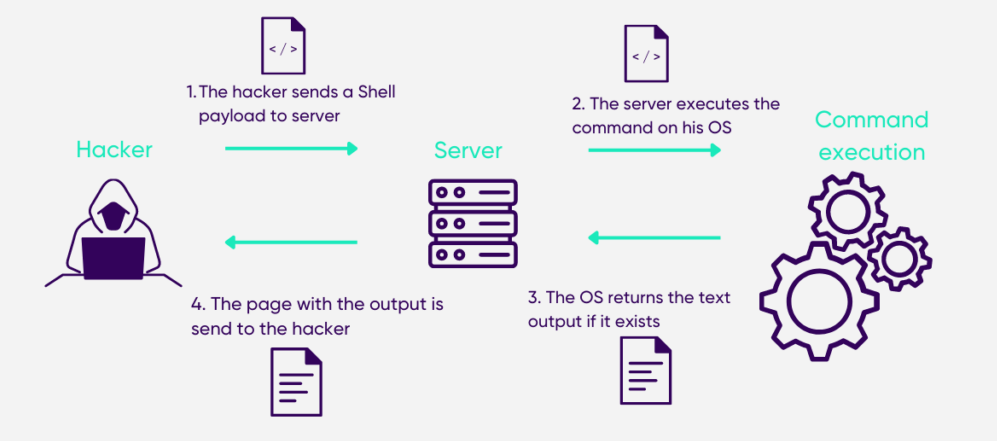

# Command injection

* `Command injection` is a type of vulnerability that allows an attacker to execute arbitrary commands on the host operating system via a vulnerable application.
* This occurs when the application passes unsafe user-supplied data to a system shell.
* As a result, an attacker can manipulate the command string to execute arbitrary commands, potentially leading to unauthorized access, data loss, or system compromise.
* For example -  
  * **Direct Command Injection**: user inputs are directly used in commands executed by the system shell.
  * **Shell Interpretation**: special characters and command separators (e.g, `;`, `|`, `&&`) are interpreted by the system shell, allowing for the injection of additional commands.

## How does Command injection works?

* **User input without proper sanitization**:

  * The application takes user input directly to construct a command.
  * For example, a web form for deleting a file might take the filename from user input.
  * Input: `file.txt; rm -rf /`
  * The application processes this input without sanitization.

* **Injected command alters expected flow**:

  * The system shell executes the command as it is received.
  * The command `rm -rf /` is executed with the same privileges as the application, leading to potential system-wide damage.
  * This causes the system to execute both `rm file.txt` and `rm -rf /`, leading to the deletion of the root directory.

## Visual representation of Command Injection

* The image illustrates how an attacker can exploit a command injection vulnerability by injecting malicious shell commands into a vulnerable application's input.
* The injected commands are executed by the OS, leading to providing potential output to the attacker.
* This could be later used by the attacker for deleting files or corrupting system data.

## What could be achieved with this vulnerability?

* **Remote Code Execution (RCE)**:
  * Attackers can execute arbitrary code on the target system.
  * For example, an attacker might run a command to download and execute malware.
  * Impact: full control over the system, enabling further malicious activities such as installing backdoors, exfiltrating data, or launching additional attacks.

* **Data Exfiltration**:
  * Attackers can read sensitive data from the system.
  * For example, an attacker might read the contents of sensitive files, such as `/etc/passwd`.

* **Privilege Escalation**:
  * Attackers can escalate their privileges to gain higher-level access.
  * For example, exploiting setuid binaries to execute commands as a superuser.

* **Denial of Service (DoS)**:
  * Attackers can disrupt the service by consuming resources or deleting critical files.
  * For example, running commands that exhaust system resources.

## Argument Injection

* `Argument injection` is a subtype of Command Injection where user input is injected into command-line arguments, altering the command's intended behavior.
* This vulnerability occurs when an application constructs command-line instructions using untrusted input as arguments, and the input is not properly validated or escaped.
* Attackers can manipulate these arguments to inject additional commands or modify the command's execution, leading to unintended behavior or security breaches.
* For example -
  * **Argument Manipulation**: malicious input changes the arguments passed to a command rather than the command itself.
  * **Command-Line Parsing**: the command-line parser processes the entire argument string, which can lead to the execution of unintended commands or modification of the command’s operation.

### How does Argument injection works?

* **Manipulation of Input Parameters**:
  * An attacker manipulates input that is used to build command-line arguments.
  * For example, a web application allows users to download files using the `curl` command, taking a user-supplied URL as an argument.

* **Injected Command Alters Behavior**:

  * Malicious input: `file:///etc/passwd`
  * The application sanitizes the input to remove characters like `;` and `|` that could be used to break the shell command.
  * The input `file:///etc/passwd` is not filtered out.
  * The command executed becomes: `curl file:///etc/passwd`
  * This leads to unintended command execution and potential system compromise.
  * The curl command is executed with the argument file:///etc/passwd.
  * The injected argument `file:///etc/passwd` causes curl to read the contents of the `/etc/passwd` file.
  * This results in unauthorized access to sensitive information on the system.

## Command Injection vs Argument Injection

* **Command Injection**:

  * **Definition**: allows attackers to execute arbitrary commands on the host operating system.
  * **Focus**: inserting and executing entire commands within an application.
  * **Impact**: full control over the system, leading to severe consequences like Remote Code Execution (RCE).

* **Argument Injection**:

  * **Definition**: allows attackers to manipulate command arguments to alter command behavior.
  * **Focus**: modifying arguments passed to commands rather than the commands themselves.
  * **Impact**: causes unintended command execution and can lead to data theft or system compromise.

## References

* <https://cheatsheetseries.owasp.org/cheatsheets/OS_Command_Injection_Defense_Cheat_Sheet.html>
* <https://portswigger.net/web-security/os-command-injection#how-to-prevent-os-command-injection-attacks>
* <https://cwe.mitre.org/data/definitions/88.html>
* <https://sonarsource.github.io/argument-injection-vectors/explained/>
* <https://www.imperva.com/learn/application-security/command-injection/>
* <https://www.wallarm.com/what/command-injection-definition>
